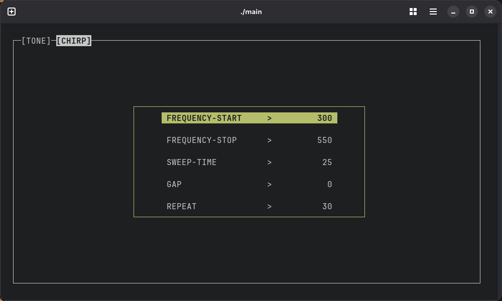

# Frequrses: A Terminal-Based Frequency Generator

Frequrses is a lightweight, terminal-based application for generating tones and frequency sweeps directly from command line. Built with C++ and the classic `ncurses` library, it provides an interactive TUI (Text-based User Interface) to control the powerful SoX (Sound eXchange) audio utility.

### Demo

Here's a glimpse of the Frequrses interface in action:



## Features

* **Two Generation Modes:**
    * **Tone:** Generate a pure tone at a fixed frequency.
    * **Chirp:** Generate a smooth frequency sweep from a start to a stop frequency.
* **Fully Interactive TUI:** No need for command-line arguments. Control everything with simple key presses within the application.
* **Real-time Parameter Editing:** Easily navigate and change frequencies, duration, gaps, and repetitions on the fly.
* **Lightweight and Fast:** Uses minimal system resources and relies on the time-tested `ncurses` and `sox` libraries.

## Installation

To get Frequrses up and running, you'll need a C++ compiler and the necessary libraries (`ncurses` and `sox`).

### 1. Install Dependencies

**On Arch Linux:**
```bash
sudo pacman -S base-devel ncurses sox
```
**On Debian/Ubuntu:**
```bash
sudo apt-get update && sudo apt-get install build-essential libncurses-dev sox
```

**On Fedora/CentOS/RHEL:**
```bash
sudo dnf groupinstall "Development Tools" && sudo dnf install ncurses-devel sox
```

### 2. Clone and Build

Clone the repository and use the provided `Makefile` to compile the project.

```bash
git clone https://github.com/MAST-CloudNet-Code/frequrses.git
cd frequrses
make
```

This will create an executable file named `main`.

## Usage

Run the application from your terminal:

```bash
./main
```

### Controls

| Key     | Action                                   |
| :------ | :--------------------------------------- |
| `t`     | Switch to **Tone** mode                  |
| `c`     | Switch to **Chirp** mode                 |
| `Tab`   | Cycle through the parameters to edit     |
| `Enter` | Select a parameter and enter a new value |
| `p`     | **Play** the sound with the current settings |
| `ctrl+c`     | Quit the application                     |


